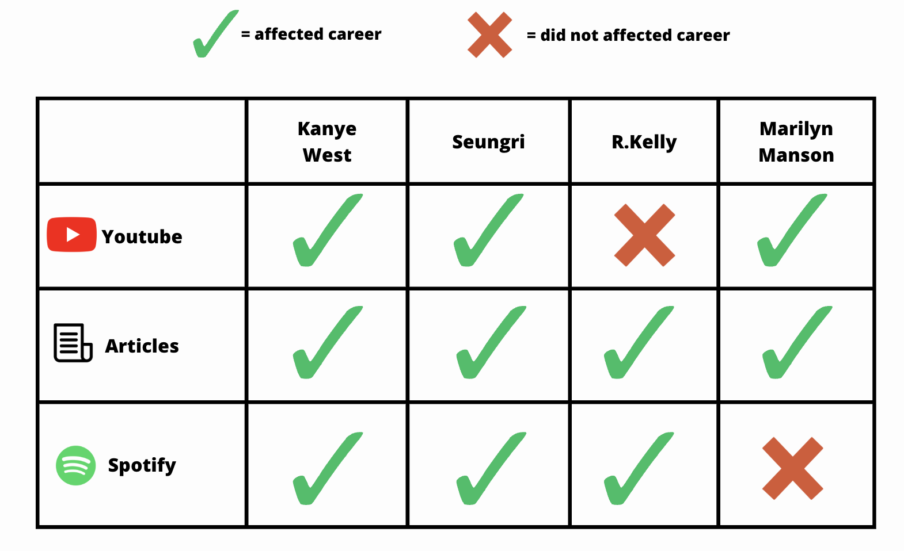

# CancelCultureImpact



## documents

[proposal doc](https://docs.google.com/document/d/1S0muNYwRjl7VOUzLw-v1KjDehOk7LdciBJQU9CxBlw4/edit?usp=sharing)

[sources doc](https://docs.google.com/document/d/1KJt7lThCYl5oBB3CRr8RVsBoyyE6Fn29DxnZULeHuec/edit?usp=sharing)

[documentation](https://docs.google.com/document/d/1nNHxZ_cACF8o5krTa1TJLUIaHWOqv7aSBus3Gc9qCMY/edit?usp=sharing)

## requirements

* Python >=3.7
* Visual Studio Code

## Python

### unix/mac
```bash
python -m venv .venv
source .venv/bin/activate
pip install -r requirements.txt
pip install --upgrade pip
```

### windows
```bash
python -m venv .venv
.\.venv\Scripts\activate
pip install -r requirements.txt
pip install --upgrade pip
```

## environment variables
* copy and rename the `.env.sample` file to `.env`

## LibreTranslate
* clone https://github.com/LibreTranslate/LibreTranslate locally
* execute these statements

```bash
pip install libretranslate
libretranslate --update-models
```